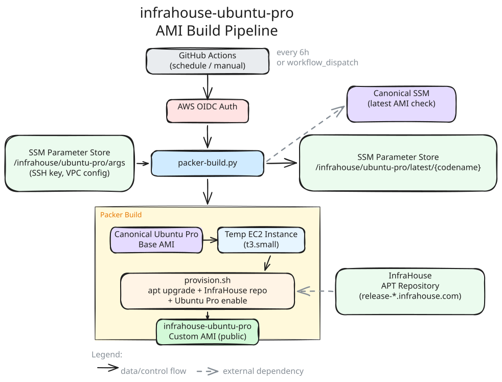

# infrahouse-ubuntu-pro

[](https://infrahouse.com/contact)
[](https://aws.amazon.com/ec2/)
[](https://ubuntu.com/pro)
[](https://www.packer.io/)

Builds customized Ubuntu Pro AMIs for AWS with pre-installed InfraHouse tools and packages.
AMIs are rebuilt automatically every 6 hours to incorporate the latest Ubuntu Pro security updates.

## Features

* Based on the latest Canonical Ubuntu Pro base image (x86_64, HVM, EBS gp3)
* Pre-configured [InfraHouse APT repository](https://infrahouse.com) with GPG key verification
* Includes [infrahouse-toolkit](https://pypi.org/project/infrahouse-toolkit/) and common packages
* Ubuntu Pro features enabled: ESM Infra, ESM Apps
* Automated builds via GitHub Actions on a 6-hour schedule
* Incremental builds - only rebuilds when Canonical publishes a new base AMI
* Manual trigger with force-rebuild option
* Published as public AMIs (built in us-west-1, copied to configurable regions)

## Installed Packages

The AMI includes the following on top of the Ubuntu Pro base:

* **System**: awscli, build-essential, jq, net-tools, sysstat
* **Python**: python3, python3-pip, python3-virtualenv, python-is-python3
* **Ruby**: ruby-dev, ruby-rubygems, plus gems (json, aws-sdk-core, aws-sdk-secretsmanager)
* **InfraHouse**: infrahouse-toolkit (from InfraHouse APT repo)

## Architecture



### Build Flow

1. **GitHub Actions** triggers on schedule (every 6 hours) or manual dispatch
2. **packer-build.py** checks if Canonical has published a new Ubuntu Pro base AMI
   - Compares the current base AMI ID (from SSM) with the latest Canonical AMI
   - Skips the build if unchanged (unless force-rebuild is set)
3. **Packer** launches an EC2 instance from the latest Ubuntu Pro base
4. **provision.sh** runs inside the instance:
   - Upgrades all system packages
   - Adds the InfraHouse APT repository with GPG key fingerprint verification
   - Installs required packages and Ruby gems
   - Enables Ubuntu Pro ESM features
   - Cleans up logs and system IDs for AMI optimization
5. Packer creates the AMI and publishes it publicly
6. The new base AMI ID is saved to SSM for future comparison

## AWS Integration

| Resource | Details |
|----------|---------|
| Region | us-west-1 |
| Authentication | OIDC (GitHub Actions) |
| SSM: `/infrahouse/ubuntu-pro/args` | Build configuration - SSH private key, VPC details, ami_regions (SecureString) |
| SSM: `/infrahouse/ubuntu-pro/latest/{codename}` | Last built base AMI ID |
| SSM: `/aws/service/canonical/ubuntu/...` | Canonical's published AMI IDs |

## Supported Ubuntu Releases

| Codename | Version |
|----------|---------|
| noble | 24.04 LTS |

## Key Files

| File | Purpose |
|------|---------|
| `packer.pkr.hcl` | Packer build definition - source AMI filter, instance config, output AMI |
| `packer-build.py` | Python orchestration - SSM parameters, SSH key handling, incremental builds |
| `provision.sh` | Bash provisioning - package installation, repo setup, Ubuntu Pro enablement |
| `.github/workflows/packer.yml` | GitHub Actions workflow - scheduled and manual triggers |

## Manual Build

Requires AWS credentials and SSM parameters to be configured.

```bash
# Set the target Ubuntu release
export UBUNTU_CODENAME=noble

# Run the orchestration script (checks for new base AMI, builds if needed)
python packer-build.py

# Force a rebuild regardless of base AMI changes
FORCE_REBUILD=true python packer-build.py
```

To run Packer directly:

```bash
packer init .
packer build \
    -var 'region=us-west-1' \
    -var 'ubuntu_codename=noble' \
    -var 'ssh_keypair_name=your-key' \
    -var 'ssh_private_key_file=/path/to/key.pem' \
    -var 'subnet_id=subnet-xxx' \
    -var 'security_group_id=sg-xxx' \
    .
```

## Requirements

* [Packer](https://www.packer.io/) >= 1.10.0
* [Packer Amazon plugin](https://github.com/hashicorp/packer-plugin-amazon) >= 1.3.0
* Python 3 with [boto3](https://pypi.org/project/boto3/)
* AWS credentials with permissions for EC2, SSM, and AMI management